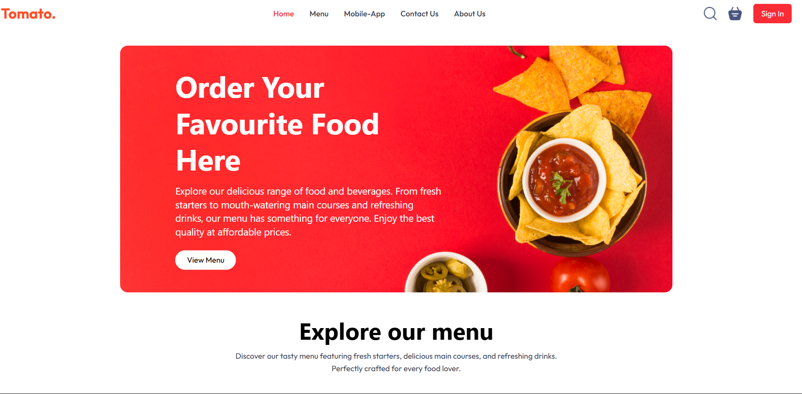

# 🍔 Food Delivery Web App

A modern and responsive web-based application for food delivery businesses. This system includes everything from authentication and menu management to invoice generation, billing history tracking, and a powerful admin dashboard.

---

## ✨ Features

- 🔐 **Authentication** – Secure login system for Admin and Staff
- 🍽️ **Menu Management** – Easily add, update, and remove menu items
- 🧾 **Invoice Creation** – Generate and print bills for customers
- 🕑 **Billing History** – Track past orders and transaction logs
- 📊 **Admin Dashboard** – Centralized management and analytics

---

## 🛠️ Tech Stack

- ⚛️ **React** – Frontend library
- 💨 **Tailwind CSS** – Utility-first CSS framework
- ⚙️ **Context API** – State management
- ⚡ **Vite** – Lightning-fast build tool

---

## 📁 File Structure

```
food-delivery/
├── public/
├── screenshot 
├── src/
│   ├── assets/             # Images, icons, etc.
           ├── admin_assets
           ├── frontend_assets
│   ├── components/         # Reusable components (Header, Sidebar, etc.)
│   ├── context/            # Context API files
│   ├── pages/              # Page components (Login, Dashboard, etc.)
│   ├── App.jsx
│   └── main.jsx
├── .gitignore
├── package.json
├── postcss.config.js
├── tailwind.config.js
└── vite.config.js
```

---

## 📸 Screenshots

> Add your actual screenshots in the `assets/` folder and update these links accordingly.

### 🔐 Login Page

---
### 📋 Menu Management


### 📋 Explore menu


### 🧾 Invoice & Billing


### 🔐 About Us Page


### 📋 Create Account Page


### 🧾 Delivery Information


---

## 🚀 Installation

Follow these steps to run the project locally:

```bash
# 1. Clone the repository
git clone https://github.com/tinavarandal24/food-delivery.git
cd food-delivery

# 2. Install dependencies
npm install

# 3. Run the development server
npm run dev
```

Open your browser at `http://localhost:5173` to view the app.

---

## 🌟 Upcoming Features

- 🛒 Customer Ordering Interface
- 📦 Order Status Tracking
- 📲 Push Notifications
- 📈 Advanced Analytics Dashboard
- 🌐 Backend Integration (Node.js + MongoDB)

---

## 📄 License

This project is licensed under the [MIT License](LICENSE).

---

## 🤝 Contributing

Contributions, issues, and feature requests are welcome!  
Feel free to fork the repo and submit a pull request. 🚀
